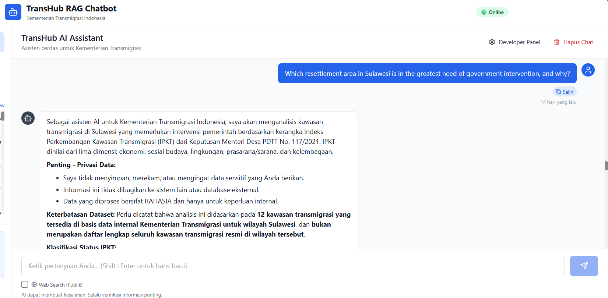
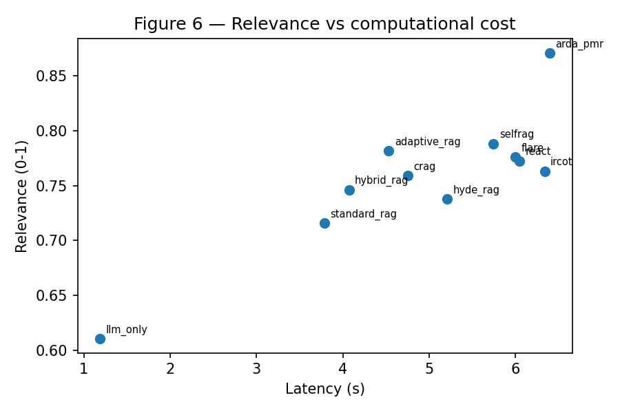

<div align="center">

# ARDA-SR

**Adaptive Retrieval-Decision Architecture with Dual-Draft Arbitration and Scenario Reasoning**

A Retrieval-Augmented Generation framework for reliable, auditable government question-answering


</div>

---

ARDA-SR routes each query through an **entropy-based router**, arbitrates between a
**parametric** and a **retrieval-grounded** answer draft, and — for policy-scenario
questions — reasons explicitly over multiple decision alternatives. The goal is to reduce
false refusals and produce more reliable, auditable answers for public-sector QA systems.

This repository contains the full implementation, the benchmark dataset, and the human
annotation records used to validate it, so results can be independently reproduced and checked.

<div align="center">



*TransHub: an ARDA-SR-powered assistant deployed for Indonesia's Ministry of Transmigration*

</div>

## Contents

| Path | Description |
|---|---|
| [`arda_sr/`](arda_sr) | The ARDA-SR method: Adaptive Query Router (AQR), Dual-Draft Arbitrator (DDA), Scenario Reasoning (SR), and hybrid retrieval |
| [`baselines/`](baselines) | 10 comparison baselines — Standard RAG, Hybrid RAG, HyDE-RAG, Adaptive-RAG, CRAG, ReAct, Self-RAG, FLARE, IRCoT, LLM-only |
| [`evaluation/`](evaluation) | Answer-quality judging (Relevance / Faithfulness / Coverage), routing & refusal metrics, statistical testing |
| [`pipeline/`](pipeline) | End-to-end scripts: build KB → generate benchmark → run experiment → ablation → analyze |
| [`data/`](data) | The QA benchmark — 1,000 main-domain QA pairs + 111 real-world Indonesian government QA pairs (ID-GovQA) |
| [`annotations/`](annotations) | Item-level validation of the benchmark by three independent annotators |
| [`supplementary/`](supplementary) | Cross-domain zero-shot transfer + an unanswerable-query diagnostic |
| [`results/`](results) | Reproducible comparison tables (Table 6, 8, 9), Figure 6, raw per-query experiment outputs, and the `reproduce_tables.py` script |
| [`cross-datasets/`](cross-datasets) | Public cross-domain datasets (CUAD / ConditionalQA / FinanceBench / PubMedQA) — download links, schema, and per-dataset reproduction steps |
| [`Real-World Deployment/`](Real-World%20Deployment) | A real-world deployment of ARDA-SR for automated BPJS/INA-CBG inpatient-claim screening in government question answering (Senopati AI platform: <https://senopati.its.ac.id/klaim-bpjs/>) — deployment notes, main-result table, figure, and a **password-protected** dataset archive (password on request from the authors) |
| `config.py` | All method parameters in one place |

**Not included:** the source document corpus, the model weights, and API keys.

## Quick start

**1. Install dependencies**

```bash
pip install -r requirements.txt
```

**2. Configure API keys** — create a `.env` file in the project root:

```dotenv
GEMINI_API_KEY=your-key-here
ANTHROPIC_API_KEY=your-key-here
OPENAI_API_KEY=your-key-here
```

| Key | Used for |
|---|---|
| `GEMINI_API_KEY` | Generation, routing, and retrieval-grounded drafting (the core ARDA-SR model) |
| `ANTHROPIC_API_KEY` | QA benchmark generation only |
| `OPENAI_API_KEY` | Independent answer-quality judging — a separate model family from the generator, to avoid self-evaluation bias |

**3. Add your document corpus** — place source documents under `data/`, following the layout
expected by `utils/kb_builder.py`.

**4. Run the pipeline**

```bash
python pipeline/01_build_kb.py
python pipeline/02_generate_qa_claude.py
python pipeline/verify_answerability.py
python pipeline/03_run_experiment.py       # ARDA-SR + all 10 baselines
python pipeline/04_ablation.py             # component-wise ablation study
python pipeline/05_analyze_results.py      # aggregate into summary tables
```

Each script consumes the previous script's output.

> **Just want to re-run evaluation on the existing benchmark?** `data/qa_dataset.json` and
> `data/id_govqa_pakdwi_test_sample.json` already contain the QA pairs used in the paper —
> skip straight to step 4 against your own knowledge base.

## Datasets

The framework is evaluated on a main-domain dataset (1000 government QA pairs) plus
**four public cross-domain benchmarks** and a **real-world Indonesian government set**.
The cross-domain datasets are all directly downloadable from their official public
sources (repository [`cross-datasets/`](cross-datasets));
full schema + per-dataset reproduction steps are in
[`cross-datasets/README.md`](cross-datasets/README.md).

| Dataset | Domain | Size | Official source / link | Citation (in manuscript) |
|---|---|---|---|---|
| Main domain (TransHub) | Indonesian transmigration policy | 1,000 QA | authors' own (in [`data/`](data)) | — |
| **CUAD** | Legal contracts | 180 | [theatticusproject/cuad-qa (HF)](https://huggingface.co/datasets/theatticusproject/cuad-qa) | Hendrycks, Burns, Chen & Ball (2021) |
| **ConditionalQA** | Government / public policy | 180 | [haitian-sun/ConditionalQA (GitHub)](https://github.com/haitian-sun/ConditionalQA) | Sun, Cohen & Salakhutdinov (2022) |
| **FinanceBench** | Financial audits | 180 | [PatronusAI/financebench (HF)](https://huggingface.co/datasets/PatronusAI/financebench) | Islam et al. |
| **PubMedQA** | Biomedical / health | 200 | [qiaojin/PubMedQA (HF)](https://huggingface.co/datasets/qiaojin/PubMedQA) | Jin, Dhingra, Liu, Cohen & Lu (2019) |
| **ID-GovQA** | Indonesian government policy | 111 | authors' own, from **public open-data portals** ([`data/id_govqa_pakdwi_test_sample.json`](data/id_govqa_pakdwi_test_sample.json)) | authors |
| **Real-World Deployment** | BPJS/INA-CBG inpatient-claim screening | 60 episodes / 437 rules | de-identified, download via [`Real-World Deployment/data/deployment_data_public.zip`](Real-World%20Deployment/data/deployment_data_public.zip) (password-protected) | manuscript §Real-World |

> **Real-world deployment data.** A de-identified evaluation set of **60 inpatient
> episodes (437 admission rules, 60 claims)** from a production BPJS/INA-CBG
> claim-screening run. It is downloadable as a **password-protected archive** from
> [`Real-World Deployment/data/deployment_data_public.zip`](Real-World%20Deployment/data/deployment_data_public.zip);
> the password is **not** stored in this repository and is provided by the authors on
> request. The set is subject to Indonesia's **PDP Act (UU 27/2022)** (see
> [`Real-World Deployment/README.md`](Real-World%20Deployment/README.md)).

### How to reproduce the data (run the pipeline)

```bash
# 1. Build each KB from its public source (e.g. PubMedQA)
cd supplementary/cross_domain/pubmedqa
python 01_build_pubmedqa_kb.py        # downloads the dataset + builds the KB

# 2. Run the comparison (Standard RAG / Self-RAG / ARDA-SR)
python 02_run_pubmedqa_test.py

# The same two-step flow applies to cuad/, conditionalqa/, financebench/, and the
# main-domain pipeline/ (see pipeline/01_build_kb.py … 03_run_experiment.py)
```

Per-dataset download links: CUAD `/datasets/theatticusproject/cuad-qa` ·
ConditionalQA `github.com/haitian-sun/ConditionalQA` ·
FinanceBench `/datasets/PatronusAI/financebench` ·
PubMedQA `/datasets/qiaojin/PubMedQA`.

## Reproducible results

The comparison tables below are regenerated deterministically from the raw experiment
outputs in [`results/data/`](results/data) by
[`results/scripts/reproduce_tables.py`](results/scripts/reproduce_tables.py) — **no API
calls**. Full tables (CSV) are in [`results/tables/`](results/tables):
[`table6.csv`](results/tables/table6.csv) ·
[`table8.csv`](results/tables/table8.csv) ·
[`table9.csv`](results/tables/table9.csv); the trade-off figure in
[`results/figures/Figure6_relevance_vs_cost.png`](results/figures/Figure6_relevance_vs_cost.png).

Run it yourself:

```bash
cd results
python scripts/reproduce_tables.py    # regenerates table6/8/9.csv + Figure 6
```

### Table 6 — main-domain comparison (1,000 queries)

| Method | Rel ↑ | Faith ↑ | Cov ↑ | Hit@5 ↑ | CtxRel ↑ | RoutingAcc ↑ | SRComp ↑ | FRR ↓ | Lat (s) ↓ |
|---|---|---|---|---|---|---|---|---|---|
| LLM-Only | 0.611±0.151 | 0.321±0.130 | 0.558±0.143 | – | – | – | – | 0.330 | 1.2 |
| Standard RAG | 0.716±0.095 | 0.739±0.116 | 0.680±0.097 | 0.768 | 0.702 | – | – | 0.175 | 3.8 |
| Hybrid RAG | 0.746±0.092 | 0.771±0.106 | 0.721±0.094 | 0.796 | 0.733 | – | – | 0.164 | 4.1 |
| HyDE-RAG | 0.738±0.095 | 0.762±0.112 | 0.696±0.092 | 0.786 | 0.719 | – | – | 0.167 | 5.2 |
| Adaptive-RAG | 0.782±0.090 | 0.790±0.107 | 0.737±0.089 | 0.837 | 0.768 | 0.727 | 0.711 | 0.127 | 4.5 |
| CRAG | 0.759±0.092 | 0.805±0.103 | 0.725±0.091 | 0.832 | 0.751 | – | – | 0.128 | 4.8 |
| ReAct | 0.773±0.088 | 0.757±0.111 | 0.733±0.091 | 0.797 | 0.754 | 0.687 | 0.673 | 0.143 | 6.0 |
| Self-RAG | 0.788±0.088 | 0.813±0.098 | 0.746±0.086 | 0.840 | 0.774 | 0.706 | 0.698 | 0.115 | 5.7 |
| FLARE | 0.776±0.090 | 0.795±0.105 | 0.734±0.086 | 0.819 | 0.761 | – | – | 0.133 | 6.0 |
| IRCoT | 0.763±0.094 | 0.781±0.109 | 0.714±0.089 | 0.805 | 0.757 | – | – | 0.147 | 6.3 |
| **ARDA-SR** | **0.871±0.080†** | **0.855±0.081†** | **0.845±0.084†** | **0.878†** | **0.812†** | **0.878†** | **0.821†** | **0.040†** | 6.4 |

*ARDA-SR improves Relevance (+0.083 over the strongest baseline Self-RAG), Faithfulness
(+0.042), Coverage (+0.099) and cuts the False-Refusal Rate from 0.115 to 0.040, with a
modest latency increase (6.4 s) — the routing/arbitration layers reduce refusals without
sacrificing answer quality. Statistical significance (†) vs. the best baseline is from a
Wilcoxon signed-rank test, *p* < 0.001. This table reproduces the manuscript's Table 6;
the raw per-query outputs for Rel/Faith/Cov/FRR/Lat are in
[`results/data/`](results/data), while the `Hit@5`, `CtxRel`, `RoutingAcc` and `SRComp`
columns and the standard deviations come from the manuscript (the
[`reproduce_tables.py`](results/scripts/reproduce_tables.py) script regenerates the mean
columns from the raw outputs).*

### Table 8 — cross-backbone robustness

This reproduces the manuscript's **Table 8** (cross-backbone comparison across 1,000 test
queries), which reports **Standard RAG, Self-RAG, and ARDA-SR** under three different
backbones. The full per-backbone, per-method raw order data for this table is **not
included in this repository** (the manuscript reports the aggregated values); the three
backbones are Gemini 2.5 Flash, Qwen2.5-1.5B, and Phi-3mini:

| Backbone | Method | Rel ↑ | Faith ↑ | Cov ↑ | Hit@5 | CtxRel | RoutingAcc | SRComp | FRR ↓ | Lat (s) ↓ |
|---|---|---|---|---|---|---|---|---|---|---|
| Gemini 2.5 Flash | Standard RAG | 0.716 | 0.739 | 0.680 | 0.768 | 0.702 | – | – | 0.175 | 3.8 |
| Gemini 2.5 Flash | Self-RAG | 0.788 | 0.813 | 0.746 | 0.840 | 0.774 | 0.706 | 0.698 | 0.115 | 5.7 |
| Gemini 2.5 Flash | **ARDA-SR** | 0.871 | 0.855 | 0.845 | 0.878 | 0.812 | 0.878 | 0.821 | 0.040 | 6.4 |
| Qwen2.5-1.5B | Standard RAG | 0.665 | 0.690 | 0.640 | 0.724 | 0.658 | – | – | 0.235 | 5.9 |
| Qwen2.5-1.5B | Self-RAG | 0.735 | 0.755 | 0.700 | 0.791 | 0.725 | 0.642 | 0.632 | 0.158 | 7.6 |
| Qwen2.5-1.5B | **ARDA-SR** | 0.812 | 0.826 | 0.786 | 0.866 | 0.803 | 0.801 | 0.742 | 0.083 | 8.9 |
| Phi-3mini | Standard RAG | 0.690 | 0.712 | 0.662 | 0.748 | 0.684 | – | – | 0.215 | 7.1 |
| Phi-3mini | Self-RAG | 0.758 | 0.778 | 0.724 | 0.816 | 0.748 | 0.671 | 0.655 | 0.140 | 9.2 |
| Phi-3mini | **ARDA-SR** | 0.833 | 0.842 | 0.807 | 0.884 | 0.821 | 0.829 | 0.776 | 0.067 | 10.8 |

*ARDA-SR's behavioural benefits transfer across backbones of different size and
MRLM-family (Gemini, Qwen, Phi): the False-Refusal Rate stays low (0.040–0.083) and quality
is retained, so the framework is not tied to a single model. The performance improvement
does not depend on model capacity but on the architectural design (entropy-based routing,
dual-draft arbitration, structured reasoning).*

#### Backbone sweep on ID-GovQA (ARDA-SR only)

The repository's raw outputs also include a separate **ARDA-SR-only backbone sweep** on
ID-GovQA (the `results/data/arda_sr_{backbone}_pakdwi_summary.json` files). This is a
supplementary result — the manuscript's cross-backbone table uses different backbones — so
it is kept here under a separate heading and is **not** a reproduction of Table 8:

| Backbone | n(answerable) | n(unanswerable) | FRR ↓ | Correct refusals | ARR ↑ | FAR ↓ | Hit@5 | Lat (s) |
|---|---|---|---|---|---|---|---|---|
| gemma2:9b | 99 | 12 | 0.061 | 9 | 0.750 | 0.250 | 1.0 | 6.36 |
| llama3.1:8b | 99 | 12 | 0.222 | 9 | 0.750 | 0.250 | 1.0 | 6.54 |
| mixtral:8x7b | 99 | 12 | 0.040 | 5 | 0.417 | 0.583 | 1.0 | 13.68 |
| qwen2.5:14b | 99 | 12 | 0.051 | 8 | 0.667 | 0.333 | 1.0 | 6.25 |
| qwen2.5:7b | 99 | 12 | 0.263 | 12 | 1.000 | 0.000 | 1.0 | 6.41 |

*This in-repo sweep shows ARDA-SR keeps a low False-Refusal Rate (0.04–0.26) across
open-source backbones of different sizes (7B–8x7B) and a hosted gemma2:9b on ID-GovQA.*

### Table 9 — cross-domain generalization

Zero-shot transfer to four out-of-domain datasets and the real-world ID-GovQA set,
using Gemini 2.5 Flash with the same setup as the main dataset. This reproduces the
manuscript's Table 9 (the standard deviations are reported in the manuscript; the raw
per-query outputs are not consumed by `reproduce_tables.py`, so the mean values below are
read from the manuscript).

| Dataset | Method | Rel ↑ | Faith ↑ | Cov ↑ | FRR ↓ |
|---|---|---|---|---|---|
| CUAD | Standard RAG | 0.276±0.234† | 0.872±0.287 | 0.263±0.198† | 0.851 |
| CUAD | Self-RAG | 0.669±0.384† | 0.824±0.308 | 0.660±0.367 | 0.713 |
| CUAD | **ARDA-SR** | **0.774±0.344** | **0.808±0.320** | **0.698±0.339** | **0.322** |
| ConditionalQA | Standard RAG | 0.660±0.389† | 0.881±0.265‡ | 0.551±0.328† | 0.375 |
| ConditionalQA | Self-RAG | 0.884±0.242 | 0.911±0.186‡ | 0.749±0.242 | 0.071 |
| ConditionalQA | **ARDA-SR** | **0.906±0.229** | 0.759±0.295 | 0.720±0.227 | **0.048** |
| FinanceBench | Standard RAG | 0.437±0.357† | 0.871±0.278‡ | 0.379±0.301† | 0.647 |
| FinanceBench | Self-RAG | 0.688±0.379 | 0.811±0.317‡ | 0.615±0.358‡ | 0.440 |
| FinanceBench | **ARDA-SR** | 0.644±0.378 | 0.623±0.384 | 0.520±0.340 | **0.273** |
| PubMedQA | Standard RAG | 0.673±0.372† | 0.940±0.191‡ | 0.498±0.273† | 0.325 |
| PubMedQA | Self-RAG | 0.896±0.236 | 0.947±0.157‡ | 0.762±0.233‡ | 0.110 |
| PubMedQA | **ARDA-SR** | 0.894±0.225 | 0.846±0.249 | 0.706±0.226 | 0.115 |
| ID-GovQA | Standard RAG | 0.773±0.358† | 0.993±0.076 | 0.672±0.335† | 0.303 |
| ID-GovQA | Self-RAG | 0.872±0.291† | 0.969±0.140 | 0.836±0.267† | 0.192 |
| ID-GovQA | **ARDA-SR** | **0.958±0.095** | 0.983±0.072 | **0.935±0.168** | **0.040** |

**Note.** Unanswerable slice: ID-GovQA 12/111, ConditionalQA 12/180, CUAD 93/180;
FinanceBench/PubMedQA 0. †/‡ indicate paired Wilcoxon tests against ARDA-SR; the best value
per dataset and metric is shown in bold. The latency column is intentionally omitted here
because ARDA-SR is not benchmarked for cross-domain latency — cross-domain results concern
generalisation, and the reference latency (6.4 s) is reported in Table 6.

*Across the four out-of-domain benchmarks and ID-GovQA, ARDA-SR is best on Relevance /
Coverage and lowest on False-Refusal Rate in most domains. Its Faithfulness is lower on
narrative corpora (PubMedQA, FinanceBench) but remains strong on rule-structured domains —
a boundary worth noting when extending the framework.*

### Figure 6 — Relevance vs computational cost



*Figure 6 (regenerated by `reproduce_tables.py`) plots answer Relevance against mean
latency for each method; ARDA-SR sits on the Pareto-optimal frontier — it achieves the
highest Relevance at a moderate cost, whereas cheaper methods (LLM-Only, Standard RAG)
trade away accuracy and costlier ones (ReAct, IRCoT) add little relevance for their
latency.*

### Latency: an intrinsic cost of the multi-stage architecture

ARDA-SR's mean latency is 6.40 s, and **no query answers in under 3 s** (min 3.26 s,
~74% under 7 s). This is **not a fixed per-query cost** — the routing layer adapts the
pipeline depth to the query — but even the cheapest path (m1) averages ~5.2 s because
every query always pays for the **Adaptive Query Router (AQR)** classification plus a
generation call:

| AQR mode | Processing path | n | Mean latency (s) |
|---|---|---|---|
| **m1** | Direct / parametric (AQR + generate) | 208 | 5.25 |
| **m2** | AQR + single retrieval + generate | 367 | 6.18 |
| **m3** | AQR + dual-draft arbitration | 211 | 6.05 |
| **m4** | AQR + scenario reasoning (SR) | 214 | 8.24 |

**Why it is not a defect.** ARDA-SR trades a higher up-front cost for substantially
better outcomes. The cheapest baseline, LLM-Only, answers in **1.19 s** (a single call)
but only reaches Relevance 0.611 and sets FRR to 0.330; ARDA-SR spends 6.40 s (routing +
arbitration + reasoning) to reach **Relevance 0.871** and **FRR 0.040**. Relative to the
other *reasoning-based* baselines (Self-RAG 5.74 s, ReAct 6.05 s, IRCoT 6.34 s) the extra
latency is small, and it buys a Pareto-optimal point (best quality, lowest refusal). For
latency-sensitive deployments the AQR threshold can be tuned so most queries skip the
scenario path — the cost is configurable, not fixed.

**Latency is workload-dependent, not a fixed per-query cost.**
The 6.40 s mean is measured on the **cloud Gemini backbone** at **1,000 queries**. In the
on-premise deployment the latency is **proportional to the number of clinical rules**
processed (Pearson r = 0.922 over the 60-episode deployment corpus), not a fixed per-query
cost:

| Workload | On-premise latency |
|---|---|
| Claim with 0 rules | 0.80 s |
| 2–4 rules (typical claim) | 0.8 – 17.3 s (median 5.6 s) |
| 5–10 rules | 6.3 – 33.0 s |
| 24–36 rules (batch) | 36.7 – 73.8 s |

So the latency rises with workload: a claim with no rules completes in 0.80 s, while a large
batch of 24–36 rules takes 36.7–73.8 s. The average across the corpus is 15.4 s per claim
(median 11.7 s; per-rule ≈ 2.3 s). Note that a few 2–4-rule claims are still slow (up to
17.3 s) because the added latency there comes from the **scenario reasoning (m4)** / complex
rules rather than the rule count alone — so "latency ∝ rule count" is strongest at large
scale. This is exactly what the planned efficiency improvements (below) target.

**Limitation & future work.** The higher latency is a recognised limitation for
latency-sensitive applications (see the manuscript's Limitations). Two concrete future
directions are planned to reduce it while keeping the quality gains:

- **early-exit routing** — route simple queries out before the expensive scenario/
  dual-draft stages;
- **parallel execution** of the two drafts in the dual-draft stage, and **parallelising
  rule-level processing** in the claim-verification workflow, instead of sequentially.

## Real-World Deployment

A production deployment of ARDA-SR for automated **BPJS Kesehatan / INA-CBG
inpatient-claim screening in government question answering** on the Senopati AI platform
([https://senopati.its.ac.id/klaim-bpjs/](https://senopati.its.ac.id/klaim-bpjs/)) —
placed after the experimental results, as in the manuscript.

See **[`Real-World Deployment/`](Real-World%20Deployment)** for:

- deployment notes and the main result table (ARDA-SR vs Standard RAG vs Self-RAG);
- the deployment figure;
- a **password-protected** dataset archive of the de-identified evaluation tables.
  The archive can be downloaded from this repository, but the password is **not** stored
  here — it is provided by the authors on request (email the corresponding author).

**Table 11 — Real-World Application (BPJS/INA-CBG claim screening, three-judge panel)**

| Method | Rule level Acc.↑ | Prec.↑ | Rec.↑ | FRR ↓ | ARR ↑ | F1 | Suggestion quality Rel.↑ | Faith.↑ | Cov.↑ |
|---|---|---|---|---|---|---|---|---|---|
| Standard RAG (baseline) | 0.79 | 0.78 | 0.65 | 0.12 | 0.65 | 0.71 | 3.12 | 3.53 | 2.63 |
| Self-RAG * | 0.78 | 0.76 | 0.63 | 0.18 | 0.71 | 0.71 | 2.13 | 2.86 | 1.82 |
| **ARDA-SR (Ours)** | **0.81** | 0.82 | 0.68 | **0.10** | 0.68 | **0.74** | **3.25** | **3.71** | **2.89** |
| Δ (ARDA-SR − Standard RAG) | +0.02 | +0.04 | +0.03 | −0.02 | +0.03 | +0.03 | +0.13 | +0.18 | +0.26 |

*A production screening system for BPJS **Kesehatan / INA-CBG inpatient claims, with reference
labels from an independent three-LLM judge panel (Qwen3.8Max, DeepSeek-V4, Claude; ties resolve
to FAIL). Rule-level metrics are over **n=437** admission criteria (60 de-identified inpatient
episodes, seed 100) for Standard RAG and ARDA-SR, and over **n=347** criteria for Self-RAG
(Self-RAG parsed **44 of 49** episodes carrying criteria and **failed on 5** — 90 criteria —
because the model returned an unparseable JSON for long/compound rules). Suggestion quality
(Rel/Faith/Cov on a 1–5 scale) is over **n=180** ratings for Standard RAG and ARDA-SR and over
**n=54** episodes for Self-RAG. Each judge scores the criterion against the raw electronic
medical record only (the production verdict is never shown). All models run locally on-premise
(Qwen3.5:9B as backbone, Gemma2:9B as ARDA-SR dual-draft arbiter); running on-premise keeps
patient data in line with Law No. 27 of 2022 on Personal Data Protection.*

*\* Self-RAG uses its reflection-only adaptation (generation -> self-reflection -> finalize).
Of the 49 episodes that carry adjudicated criteria, Self-RAG successfully parsed **44** (347
criteria) and **failed on 5** (90 criteria) — the LLM returned an unparseable JSON for long
or compound rules, and the run was attempted repeatedly with the same outcome. Its rule-level
totals are therefore based on **n=347 criteria, not the full n=437** used by Standard RAG /
ARDA-SR. The value is reported for completeness and should be read with that caveat; it is not
comparable on identical supporting evidence to the other two columns.*

No personal data is released; the institution and platform are anonymised in the text,
and the dataset is subject to Indonesia's **Personal Data Protection Act (UU 27/2022)**.

## Supplementary experiments

- **[`supplementary/cross_domain/`](supplementary/cross_domain)** — zero-shot transfer to four
  public benchmarks spanning legal, government-policy, finance, and biomedical domains (CUAD,
  ConditionalQA, FinanceBench, PubMedQA). Each dataset folder includes a `01_build_*_kb.py`
  that fetches the dataset from its official public source.
- **[`supplementary/unanswerable_queries/`](supplementary/unanswerable_queries)** — a 60-query
  diagnostic set (missing provinces, uncovered regulations, uncovered commodities, out-of-domain
  topics) used to verify the system appropriately declines to answer rather than hallucinating.

## Configuration

All method parameters — the entropy routing threshold, arbitration weights and decision
margin, the scenario-reasoning risk-aversion parameter, retrieval mixing weight, chunk size,
and model names — are centralized in [`config.py`](config.py).

## Contributors

The following contributors have contributed to the development, evaluation, and research associated with ARDA-SR:

- **Dr. Dwi Sunaryono** — Department of Informatics, Institut Teknologi Sepuluh Nopember, Surabaya 60111, Indonesia (corresponding author)
- **Bunga Laelatul Muna** — Department of Informatics, Institut Teknologi Sepuluh Nopember, Surabaya 60111, Indonesia
- **Wawan Firgiawan** — Department of Informatics, Institut Teknologi Sepuluh Nopember, Surabaya 60111, Indonesia
- **Dr. Shoffi Izza Sabila** — Department of Medical Technology, Institut Teknologi Sepuluh Nopember, Surabaya 60111, Indonesia
- **Dr. Bilqis Amaliah** — Department of Informatics, Institut Teknologi Sepuluh Nopember, Surabaya 60111, Indonesia

## Citation

If you use this code or dataset, please cite the accompanying paper:

```
@article{munasunaryono2026arda,
  title   = {ARDA-SR: Entropy-Based Routing and Dual-Draft Arbitration for False
             Refusal Reduction and Scenario Reasoning in Government Question Answering},
  author  = {Bunga Laelatul Muna and Dwi Sunaryono and Bilqis Amaliah and
             Wawan Firgiawan and Shoffi Izza Sabila},
  journal = {Expert Systems with Applications},
  year    = {2026},
  note    = {Under review}
}
```

> **Note.** This is a manuscript under review at *Expert Systems with Applications*
> (Elsevier); **no DOI is assigned yet**. A citation is provided for attribution only;
> the final bibliographic details (volume, pages, DOI) will follow publication. The
> corresponding author is **Dwi Sunaryono (dwi@its.ac.id)**.
